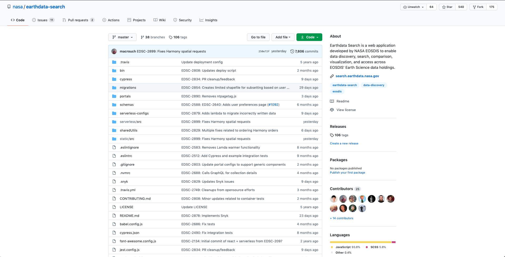

<!-- .slide: data-background-image="https://cdn.pixabay.com/photo/2015/09/09/19/08/sky-932661_1280.jpg" data-background-opacity=".3"  -->
# Developing in the cloud
Tim Goff \
timothy.d.goff@raytheon.com \
timothy.d.goff@nasa.gov

---
<!-- .slide: data-background-image="img/IMG_20200826_193120.jpg" data-background-opacity=".5"  -->

## Who am I?
- Tim Goff
    - Earthdata Cloud Senior Developer
    - Graduated '04 from University of Maryland
    - Work from home in the beautiful New River Valley of VA
    - 16 years with Raytheon - All on NASA EED Contract
        - Started with legacy C++ applications
        - Moved to greenfield Java backend development
        - Ruby and javascript search application
        - Clojure metadata catalog development
        - Earthdata Cloud Platform

Notes: Didnt start in the cloud, but organically moved there as the project evolved.  Large project with lots of different teams.

---
<!-- .slide: data-background-image="https://cdn.pixabay.com/photo/2020/09/01/06/00/sky-5534319_1280.jpg"  data-background-opacity=".2"  -->
## Developing in the Cloud
- Many cloud providers, but AWS, Azure and GCP are the main players
- Will focus on AWS (because that is where my experience is)
    - But most of this information applies in all providers
- Cloud requires developers to focus on things that were previously handled by Infrastructure teams
- No model or framework works for all situations, and technologies/best practices change over time.  
    - And cloud moves even faster

Notes: Otherwise we would be developing webapps with Java Server Pages or CGI and APIs with SOAP 

---
<!-- .slide: data-background-image="https://cdn.pixabay.com/photo/2017/06/14/16/20/network-2402637_1280.jpg"  data-background-opacity=".2"  -->
## PaaS vs IaaS - Review
- PaaS EDC - managed by Ruby backend and API
    - Applications uploaded as tar files or Docker containers and deplopyed to EC2/ECS
- Iaas EDC
    - Applications have the keys to full(*) AWS experience
    - Guardrails built to ensure applications are compliant, secure, and app owners cant do things they shouldnt be able to
- Why IaaS?
    - Allows cloud native application development using most of the growing suite provided by AWS
    - Developers want to be able to use the full potential of the cloud
    - But the number of services in the cloud is both an opportunity and risk.

Notes: PaaS is by necessity more restrictive in terms of application design and available services.  But IaaS can be harder to govern.  From a developer view, you want all the things, but that makes the security/governance story a bit more complex.  One is not the "right" answer all the time.

---
<!-- .slide: data-background-image="https://cdn.pixabay.com/photo/2015/09/05/20/02/coding-924920_1280.jpg"  data-background-opacity=".2"  -->
## Developing for the cloud
- 12 factor app - https://12factor.net/
    - Simple, standalone services which do not have dependencies baked in
    - Critical when deploying via containers or on a PaaS where you do not control the infrastructure
- DevOps
- Source control

Notes: 12 Factor encompasses a lot of the other bullets here and in the next slide.

---
<!-- .slide: data-background-image="https://cdn.pixabay.com/photo/2015/09/05/20/02/coding-924920_1280.jpg"  data-background-opacity=".2"  -->


*From https://www.quora.com/Is-the-Twelve-Factor-App-methodology-correct*

---
<!-- .slide: data-background-image="https://cdn.pixabay.com/photo/2015/09/05/20/02/coding-924920_1280.jpg"  data-background-opacity=".2"  -->
## Developing for the cloud
- Microservices
    - Multiple small independent services instead of a monolithic application
    - Indepdendently scalable services
- Serverless/containers
    - Lambda
    - ECS/EKS
- Cattle vs Pets
- Managed services
    - DB, CDN, etc
    - Fargate vs self managed ECS  

---
<!-- .slide: data-background-image="https://cdn.pixabay.com/photo/2015/09/05/20/02/coding-924920_1280.jpg"  data-background-opacity=".2"  -->
### Example - CMR (microservices)


https://github.com/nasa/Common-Metadata-Repository

---
<!-- .slide: data-background-image="https://cdn.pixabay.com/photo/2015/09/05/20/02/coding-924920_1280.jpg"  data-background-opacity=".2"  -->
### Example - Earthdata Search (serverless)


https://github.com/nasa/earthdata-search

---
<!-- .slide: data-background-image="https://cdn.pixabay.com/photo/2019/02/27/11/20/bird-migration-4023842_1280.jpg"  data-background-opacity=".2"  -->
## Migrating to the Cloud

- Containerized, 12 factor apps are easier to port
    - Good to keep these in mind when developing on prem.
- Lift and Shift
    - Take existing app and infrastructure and deploy it in the cloud
    - Seems easier and cheaper, but misses many benefits of the cloud
- Cloud Native rewrite
    - More work up front, but can end up with a cheaper more efficient system ultimately
- Some legacy apps can/should be rewritten as lambdas
    - BUT NOT ALL
    - Deploy to EC2 instances where it make sense.
    - A poorly designed/considered lambda can make things worse.
- No one-sized-fits-all architecture

Notes: The first lambda I wrote was a port of a legacy Ruby app.  But due to the way I implemented it, the cold start time was huge and it never made it to production until it was rewritten again as a better designed lambda.

---
<!-- .slide: data-background-image="https://cdn.pixabay.com/photo/2015/09/29/22/49/blueprint-964630_1280.jpg"  data-background-opacity=".2"  -->
## Infrastructure as Code (IaC)

- Source control your whole infrastucture
    - Including networking
- Repeatable and recoverable architecture
- Everything except for data is Cattle 

Note: All of these best practices are guidelines, and sometimes simplicity and convenience wins out.  I for instance use terraform for everything at work, but my personal AWS account is a mess of manually spun up stuff.

---
<!-- .slide: data-background-image="https://cdn.pixabay.com/photo/2015/09/29/22/49/blueprint-964630_1280.jpg"  data-background-opacity=".2"  -->
## CloudFormation

- https://aws.amazon.com/cloudformation/
    - Built in to AWS
    - YAML or JSON syntax

```yaml
myVPC:
  Type: AWS::EC2::VPC
  Properties:
    CidrBlock: 10.0.0.0/16
    EnableDnsSupport: 'false'
    EnableDnsHostnames: 'false'
    InstanceTenancy: dedicated
    Tags:
     - Key: foo
       Value: bar
```

```json
"myVPC" : {
   "Type" : "AWS::EC2::VPC",
   "Properties" : {
      "CidrBlock" : "10.0.0.0/16",
      "EnableDnsSupport" : "false",
      "EnableDnsHostnames" : "false",
      "InstanceTenancy" : "dedicated",
      "Tags" : [ {"Key" : "foo", "Value" : "bar"} ]
   }
}
```
---

<!-- .slide: data-background-image="https://cdn.pixabay.com/photo/2015/09/29/22/49/blueprint-964630_1280.jpg"  data-background-opacity=".2"  -->
## Terraform

- https://www.terraform.io/
    - Multi cloud
    - More dynamic JSON-like DSL (HCL)

```terraform
resource "aws_vpc" "app" {
  cidr_block           = var.vpc_cidr_range
  enable_dns_hostnames = true
  enable_dns_support   = true

  tags = {
    Name                   = "Application VPC"
  }
}

resource "aws_subnet" "private_app" {
  # private subnets in different AZs
  count                   = var.num_private_subnets
  vpc_id                  = aws_vpc.app.id
  map_public_ip_on_launch = false
  availability_zone       = element(data.aws_availability_zones.available.names, count.index)
  cidr_block = 10.0.0.0/16

  tags = {
    Name                   = "Private application ${data.aws_availability_zones.available.names[count.index]} subnet"
  }
}
```

---

<!-- .slide: data-background-image="https://cdn.pixabay.com/photo/2015/09/29/22/49/blueprint-964630_1280.jpg"  data-background-opacity=".2"  -->
## Terraform Plan
```terraform
Terraform will perform the following actions:

  # aws_autoscaling_group.terraboard will be updated in-place
  ~ resource "aws_autoscaling_group" "terraboard" {
        default_cooldown          = 300
        desired_capacity          = 1
        enabled_metrics           = []
        force_delete              = false
        health_check_grace_period = 300
        health_check_type         = "EC2"
        id                        = "terraboard-ecs-instance-node"
      ~ launch_configuration      = "terraboard20200722203138632000000001" -> (known after apply)
 ...
        wait_for_capacity_timeout = "10m"
    }

  # aws_launch_configuration.terraboard must be replaced
+/- resource "aws_launch_configuration" "terraboard" {
        associate_public_ip_address      = false
      ~ ebs_optimized                    = false -> (known after apply)
        enable_monitoring                = true
        iam_instance_profile             = "ecs-terraboard-instance-profile"
      ~ id                               = "terraboard20200722203138632000000001" -> (known after apply)
      ~ image_id                         = "ami-xxxxx" -> "ami-yyyyy" # forces replacement
        instance_type                    = "t2.micro"
        key_name                         = "terraboard"
      ~ name                             = "terraboard20200722203138632000000001" -> (known after apply)
...
        user_data                        = "1ab124d9ab7203022efa4cd220a2ac1e1f5c970f"
      - vpc_classic_link_security_groups = [] -> null
    }

Plan: 1 to add, 1 to change, 1 to destroy.
```

---
<!-- .slide: data-background-image="https://cdn.pixabay.com/photo/2018/02/15/18/29/devops-3155972_1280.jpg"  data-background-opacity=".1"  -->

## Continuous Integration Continuous Deployment CICD

- As with any codebase, Pull Requests need to be tested prior to merge
- Infrastructure is harder to test than application code
    -  Use lambdas and canaries 
- Where possible - test lambdas locally
- Spin up and test containers in CI environment
- Monitoring of key metrics/logs
- AWS CodeStar suite or other SaaS offerings (e.g. Jenkins)
- Use Config as Code to define buld process

---
<!-- .slide: data-background-image="https://cdn.pixabay.com/photo/2018/02/15/18/29/devops-3155972_1280.jpg"  data-background-opacity=".1"  -->
### CodePipeline


---
<!-- .slide: data-background-image="https://cdn.pixabay.com/photo/2018/02/15/18/29/devops-3155972_1280.jpg"  data-background-opacity=".1"  -->
## CodePipeline
```yaml
phases:
  install:
    commands:
      - "apt install unzip -y"
      - "wget https://releases.hashicorp.com/terraform/0.12.26/terraform_0.12.26_linux_amd64.zip"
      - "unzip terraform_0.12.26_linux_amd64.zip"
      - "mv terraform /usr/local/bin/"
  pre_build:
    commands:
      - cd modules/terraboard
      - terraform init
  build:
    commands:
      - terraform plan -input=false -parallelism=5 -var tf_state_bucket=ngap-tf-state-561cf2bf32bfb2832b7a38e0b3b07d14 -out terraboard.pipeline.plan
  post_build:
    commands:
      - echo terraform $TF_COMMAND completed on `date`
artifacts:
  files:
    - modules/**/*
  name: build_output
```
---
<!-- .slide: data-background-image="https://cdn.pixabay.com/photo/2016/12/01/01/32/blue-ridge-1874266_1280.jpg"  data-background-opacity=".2"  -->
## Final Thoughts/Resources

- Set up a free tier (AWS/Azure/GCP/etc) account
    - No one knows everything
    - No one follows their own best practices all the time.
    - New services being added constantly
- Embrace Infrastructure as Code/Config as Code
- Utilize cloud native concepts where possible
- Follow people on twitter e.g @QuinnyPig, @jeffbarr
- Podcasts/Newsletters: 
    - https://www.lastweekinaws.com/podcast/aws-morning-brief/
    - https://aws.amazon.com/blogs/
- Reinvent: Virtual and Free this year! https://reinvent.awsevents.com/
- Pursue cloud certification.  AWS probably more in demand, but Azure seems to be gaining stature.
- ACloudGuru: Excellent certification prep, some of it free https://acloudguru.com/ 

